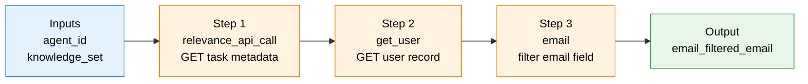
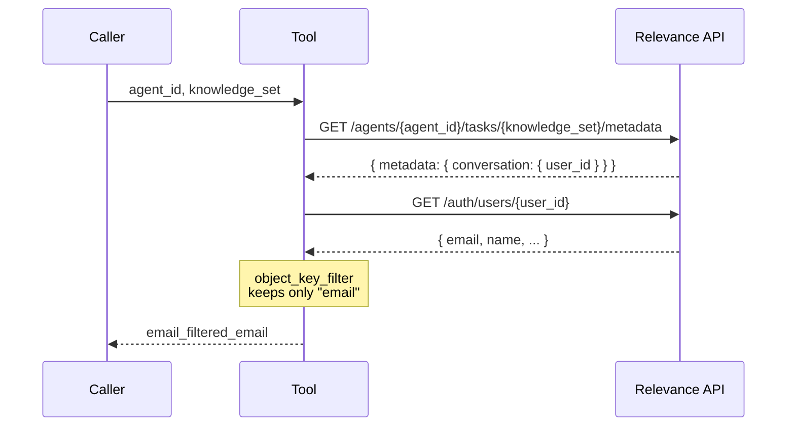

# Get User's Email who triggered the Agent

A Relevance AI tool that retrieves the email address of the user who triggered an agent via chat.

## Overview

When an agent runs a task in Relevance AI, the task is tied to the user who initiated the conversation. This tool walks that link — task metadata → user record → email — and returns just the email string, so downstream steps (notifications, CRM lookups, personalized replies) can use it directly.

## Tool Details

| Field | Value |
|---|---|
| **Studio ID** | `cf74c7cd-9ca5-41fb-a675-619dea92d418` |
| **Active Version ID** | `dcfda753-d7f1-4d53-9d7e-c9acc8b0bfe9` |
| **Visibility** | Private (not in marketplace, not publicly triggerable) |
| **Integration Requirements** | None — no API keys or OAuth needed |

## Inputs

Both parameters are required.

| Parameter | Type | Description |
|---|---|---|
| `agent_id` | string | The ID of the agent that was triggered |
| `knowledge_set` | string | The knowledge_set / task ID for the conversation |

## Output

| Field | Type | Description |
|---|---|---|
| `email_filtered_email` | string | The email address of the user who triggered the agent |

## How It Works

The tool runs three sequential steps. Each step's output feeds the next.



### Step-by-step

**1. `relevance_api_call` — Fetch task metadata**

Calls the Relevance AI API to get metadata about the conversation, which contains the `user_id` of whoever triggered the agent.

```
GET /agents/{{agent_id}}/tasks/{{knowledge_set}}/metadata
```

Returns `response_body.metadata.conversation.user_id` for the next step.

**2. `get_user` — Fetch the user record**

Uses the `user_id` from step 1 to look up the full user record.

```
GET /auth/users/{{relevance_api_call.response_body.metadata.conversation.user_id}}
```

Returns the user object containing the email and other profile fields.

**3. `email` — Extract the email field**

Runs an `object_key_filter` transformation on the user response to pull out only the `email` field, discarding everything else.

## Data Flow

How the data is shaped at each stage:



## Usage

### Calling the tool

Provide both `agent_id` and `knowledge_set` when invoking the tool. Within an agent context, these are typically available as runtime variables.

```json
{
  "agent_id": "your-agent-id",
  "knowledge_set": "your-knowledge-set-id"
}
```

### Example response

```json
{
  "email_filtered_email": "user@example.com"
}
```

## Common Use Cases

- **Personalized responses** — Greet the user by name (after a follow-up lookup) or reference their email in replies.
- **CRM lookups** — Use the email to find the contact in HubSpot, Salesforce, etc.
- **Notifications** — Send confirmation emails or alerts to the triggering user.
- **Access control** — Verify the user's identity before performing sensitive actions.

## Metadata

- **Created:** 2026-05-12
- **Last updated:** 2026-05-12
- **Creator:** Jeff Haw